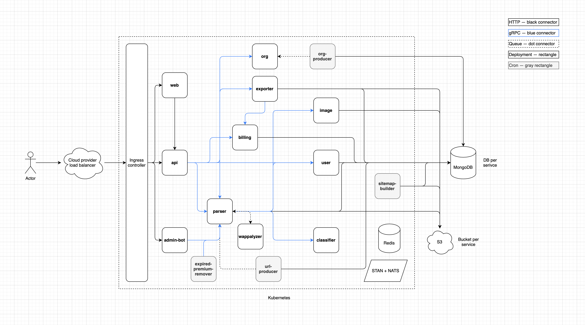

# LEAQ

## 👀 Overview

[LEAQ](https://leaq.ru) is the scraper. Currently, is has 2.1M [companies](https://leaq.ru) with websites, and 2.6M [legal entities](https://leaq.ru/orgs) (next will mention it _orgs_)

Backend has [API](https://api.leaq.ru/docs/), and option to download all 2.1M companies in single `csv` file. Backend services adds and index companies 24/7 with queues and cron jobs for repetitive tasks. All workers and services are stateless and scraping scales horizontally

## 🍬 Product features

- Companies export [constructor](https://leaq.ru)
- [Add](https://leaq.ru/account/companies/apply) new company by URL. Option to confirm website ownership by metatag and edit your company info
- Billing has free and paid [plans](https://leaq.ru/plans)
- Social sign in

## 🛠️ Architecture

## 🚀 Run

### Infrastructure

First you need to run some infrastructure services:

- [MongoDB](https://github.com/mongodb/mongo);
- [STAN](https://github.com/nats-io/nats-streaming-server);
- [Redis](https://github.com/redis/redis);
- S3 compatible object storage. [MinIO](https://github.com/minio/minio), [DO Spaces](https://m.do.co/c/e184951ce095), [AWS S3](https://aws.amazon.com/s3/?nc1=h_ls), etc;
- (Optionally) [Kubernetes](https://github.com/kubernetes/kubernetes);

### Config

Any service accept config via environment variables. Go services has a config at `config/config.go`. [Wappalyzer](https://github.com/leaq-ru/wappalyzer) config at `config/env.js`. [Web](https://github.com/leaq-ru/web) config at `nuxt.config.js`

### Code

Discover repositories [here](https://github.com/leaq-ru)

### Deploy

You can build code from source or use [Docker images](https://github.com/orgs/leaq-ru/packages). Also, each service has K8s manifest

## 📨 Contact

[Telegram](https://t.me/aveDenis)
